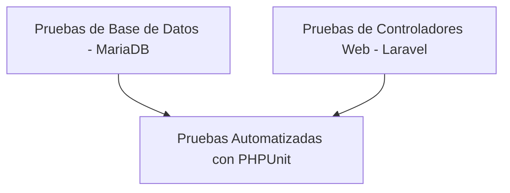

# Plan de Pruebas - JASS Quilcata / Ayacucho (Solo Backend)

> **Plan unificado:** El roadmap vigente (incluye API REST, PHPUnit por fases y cronograma) está en [`pruebas/plan_implementacion.md`](../../pruebas/plan_implementacion.md). Este documento conserva la estrategia técnica de ambiente MariaDB y casos web históricos.

Este documento define la estrategia, alcance, ambiente y casos de prueba centrados **exclusivamente en el Backend y la lógica del servidor (Web/Controladores y Base de Datos)** para el sistema de la **Junta Administradora de Servicios de Saneamiento (JASS) Quilcata / Ayacucho**.

La API REST (`/api/v1/*`) queda **fuera del alcance de este documento histórico**; ver el plan unificado para cobertura API.

---

## 1. Objetivos del Plan de Pruebas (Backend)

- **Garantizar la exactitud de la base de datos:** Validar que los procedimientos almacenados, triggers y cálculos financieros (cobros, deudas y egresos) funcionen correctamente en el servidor.
- **Asegurar la seguridad de acceso Web:** Comprobar que el middleware de Laravel restrinja correctamente el acceso a las rutas web de administrador y operador según el rol.
- **Validar el flujo de datos en controladores:** Asegurar que las validaciones de datos y operaciones en los controladores web (`App\Http\Controllers\Admin` y `App\Http\Controllers\Operator`) procesen la información de manera segura.

---

## 2. Alcance (Scope)

### 2.1. Dentro del Alcance (In-Scope)
- **Rutas y Controladores Web (`routes/web.php`):**
  - Autenticación tradicional mediante sesiones (Login/Logout).
  - Controladores de Administración (Gestión de vecinos, cobros, egresos, multas, tarifas, reportes, asistencia).
  - Controladores de Operador (Inicio/cierre de jornada de cobros, registro de cobros, marcas de asistencia).
- **Procedimientos Almacenados y Triggers (MariaDB):**
  - `sp_registrar_cobro` (Cálculo de cobros y generación de número de serie).
  - `sp_calcular_deuda_vecino` (Cálculo de deudas acumuladas).
  - Triggers de auditoría y actualizaciones automáticas.
- **Generación de Archivos en Servidor:**
  - Generación de reportes mensuales y comprobantes de cobro en PDF.
  - Almacenamiento en disco (`storage/app`).

### 2.2. Fuera del Alcance (Out-of-Scope)
- **API REST (`/api/v1/*`):** Todos los endpoints JSON y autenticación con Laravel Sanctum quedan excluidos de estas pruebas.
- **Frontend (Client-side):** Pruebas de interfaces de usuario, diseño CSS, interactividad JavaScript en navegador, y rendimiento del lado del cliente.

---

## 3. Estrategia de Pruebas para Backend

La suite de pruebas automatizadas se enfocará en dos niveles principales ejecutados desde el servidor:



### 3.1. Pruebas de Base de Datos (Integración)
- Verificación directa de que las llamadas de Laravel a MariaDB ejecutan los procedimientos almacenados sin fallos de tipo de datos o desbordamiento.
- Pruebas sobre triggers de auditoría (comprobar que la inserción o modificación de datos críticos escriba en `login_logs` o tablas de auditoría general).

### 3.2. Pruebas de Controladores Web (Feature/Web Tests)
- Pruebas HTTP que simulan peticiones a las rutas de `/admin/*` y `/operador/*` y aseguran que:
  - Se realicen redirecciones correctas en caso de accesos no autorizados (código 302 a `/login`).
  - Se validen adecuadamente los formularios Web.
  - Se guarden los datos correctos tras enviar formularios (acciones `store`, `update`, `destroy`).

---

## 4. Ambiente de Pruebas y Desafío Técnico

Como la lógica financiera clave reside en procedimientos almacenados de MariaDB, **no se puede utilizar SQLite en memoria (`:memory:`)**. Las pruebas deben ejecutarse apuntando a una base de datos real MariaDB dedicada a pruebas.

### Pasos para configurar el entorno de pruebas backend:
1. **Crear base de datos de pruebas:**
   ```sql
   CREATE DATABASE IF NOT EXISTS jass_quilcata_test;
   ```
2. **Cargar esquema y procedimientos almacenados:**
   Importar el archivo `Database/jass_quilcata_full.sql` en `jass_quilcata_test` para disponer de todas las tablas y procedimientos almacenados.
3. **Configurar el entorno en `phpunit.xml`:**
   Configurar las variables de entorno de base de datos apuntando a la base de pruebas:
   ```xml
   <env name="DB_CONNECTION" value="mysql"/>
   <env name="DB_HOST" value="127.0.0.1"/>
   <env name="DB_PORT" value="3307"/> <!-- Puerto mapeado de MariaDB -->
   <env name="DB_DATABASE" value="jass_quilcata_test"/>
   <env name="DB_USERNAME" value="root"/>
   <env name="DB_PASSWORD" value="root_password"/>
   ```

---

## 5. Matriz de Casos de Prueba del Backend

### Módulo 1: Control de Acceso y Sesión Web (`routes/web.php`)

| ID | Tipo | Descripción | Entrada / Acción | Resultado Esperado en Servidor |
| :--- | :--- | :--- | :--- | :--- |
| **WEB-AUT-01** | Web Test | Login de usuario exitoso | Petición POST a `/login` con credenciales válidas | Redirige al dashboard adecuado según rol, guarda sesión activa |
| **WEB-AUT-02** | Web Test | Login de usuario incorrecto | Petición POST a `/login` con clave incorrecta | Redirige de vuelta a `/login` con errores de validación en sesión |
| **WEB-AUT-03** | Web Test | Redirección de Invitados | Acceso a `/admin/inicio` sin sesión activa | Redirige (302) a `/login` |
| **WEB-AUT-04** | Web Test | Restricción de Roles Web | Usuario con rol `Operador` intenta acceder a `/admin/usuarios` | Retorna error 403 (Unauthorized) |

### Módulo 2: Controladores de Cobros y Transacciones (Web)

| ID | Tipo | Descripción | Entrada / Acción | Resultado Esperado en Servidor |
| :--- | :--- | :--- | :--- | :--- |
| **WEB-COB-01** | Integración | Llamada a procedimiento `sp_registrar_cobro` | Enviar datos de cobro a `CobroController@store` | El controlador ejecuta el SP en la BD, se inserta el cobro con la serie autogenerada |
| **WEB-COB-02** | Integración | Validación de Cobro Duplicado | Intentar registrar cobro para el mismo vecino y periodo | El SP arroja una excepción de base de datos; el controlador la captura y responde con error controlado |
| **WEB-COB-03** | Web Test | Flujo de Jornada de Cobro (Operador) | Enviar POST a `/operador/cobros/iniciar` | Crea una fila activa en `jornadas_cobro` asociada al usuario logueado |
| **WEB-COB-04** | Web Test | Cierre de Jornada de Cobro (Operador) | Enviar POST a `/operador/cobros/cerrar/jornada` | Actualiza la jornada actual, calculando la recaudación total en el backend |

### Módulo 3: Egresos y Reportes (Web)

| ID | Tipo | Descripción | Entrada / Acción | Resultado Esperado en Servidor |
| :--- | :--- | :--- | :--- | :--- |
| **WEB-EGR-01** | Web Test | Aprobación de Egreso por Administrador | Enviar POST a `/admin/egresos/{id}/aprobar` | Cambia el estado del egreso a `aprobado` y registra el ID del admin aprobador |
| **WEB-EGR-02** | Web Test | Rechazo de Egreso con validación de motivo | Enviar POST a `/admin/egresos/{id}/rechazar` sin especificar motivo | Falla la validación del backend y no procesa el cambio de estado |
| **WEB-REP-01** | Web Test | Generación de PDF de Comprobante / Reporte | Enviar GET a `/admin/reportes/{id}/pdf` | Genera y retorna un stream de archivo PDF válido para descarga |

---

## 6. Próximos Pasos de Codificación

1. **Crear archivo `.env.testing`** para desacoplar las pruebas de la base de datos de desarrollo.
2. **Implementar clase base de pruebas** en `tests/TestCase.php` que maneje la inicialización y el rollback de transacciones en la base de datos de pruebas MariaDB.
3. **Escribir el primer test de controlador web** en `tests/Feature/Admin/UsuarioControllerTest.php` para validar la creación y listado de vecinos.
